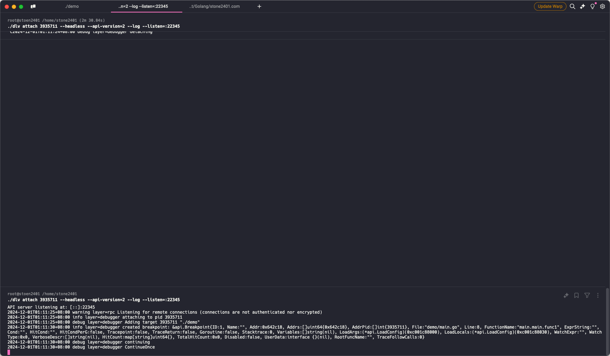
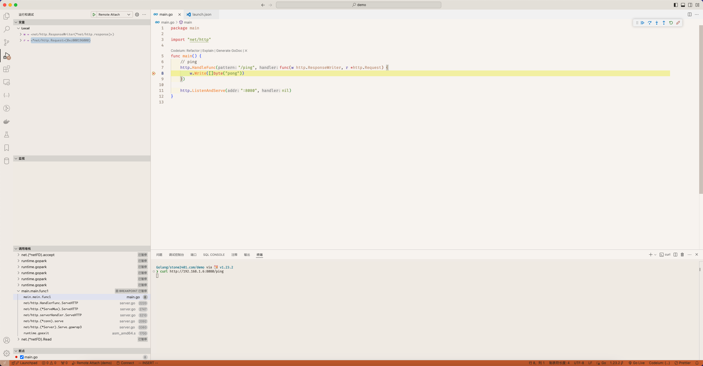

## 记一次 VSCode 远程调试 Golang 程序

以下记录了一次使用 VSCode 和 Delve 调试 Go 程序的过程，不区分服务器与 Docker 环境。

#### 原理概述

`远程调试 Golang 程序的核心是通过 Delve (dlv) 调试器，将目标程序的运行状态暴露在网络接口上，然后使用 VSCode 或其他支持 Delve 的调试工具连接到这个接口，完成断点、变量检查等调试操作。`

主要过程如下：
1.	编译 Delve 工具：将 Delve 编译为目标系统架构的可执行文件，用于远程运行调试服务。
2.	编译 Go 程序：为调试目的重新编译 Go 程序，确保启用必要的调试信息。
3.	运行 Delve 服务：以 headless 模式启动 Delve，监听指定端口并附加到目标程序进程。
4.	配置 VSCode：通过 VSCode 的 launch.json 文件定义远程调试的连接参数。
5.	启动调试：VSCode 连接到 Delve 服务，即可进行远程调试。

适用于以下场景：
•	`本地或远程服务器上的 Go 程序。`
•	`容器（Docker）中运行的 Go 程序。`
•	`ARM、x86_64 等不同架构的环境。`

操作步骤如下：

---
### 1. 编译 Delve 工具

首先，克隆 Delve 的仓库，并编译为目标服务器需要的架构：
```bash
git clone https://github.com/go-delve/delve.git
cd delve
go mod tidy
CGO_ENABLED=0 GOOS=linux GOARCH=arm64 go build -trimpath -o dlv cmd/dlv/main.go
```
编译完成后，将生成的 dlv 可执行文件上传到目标服务器。

---
### 2. 启动你的 Go 程序
在调试前，需要重新打包 Golang 程序并添加调试标志：
```bash
CGO_ENABLED=0 GOOS=linux GOARCH=arm64 go build -gcflags="all=-N -l" -o myapp
```
解释：
`CGO_ENABLED=0`
	•	禁用 CGO（C语言扩展）。
	•	CGO 是 Go 中与 C 语言交互的功能模块，当你需要完全静态编译的二进制文件（不依赖系统的动态库）时，通常将其禁用。
	•	设置为 0 表示禁用，生成的程序不依赖任何动态链接库，可以更方便地在其他环境中运行。
`GOOS=linux`
	•	指定目标操作系统为 Linux。
	•	Go 支持交叉编译，这里的 GOOS 表示目标程序将在 Linux 操作系统上运行，无论你当前的开发环境是 Windows、Mac 还是其他系统。
`GOARCH=arm64`
	•	指定目标架构为 ARM64。
	•	GOARCH 是目标 CPU 架构，此处表示程序将运行在 64 位 ARM 处理器上，例如 Raspberry Pi、云服务器上的 ARM 实例等。
`-gcflags="all=-N -l"`
	•	用于调整 Go 编译器的行为，主要影响优化设置：
	•	-N：关闭优化，使代码结构尽量保留原样，便于调试。
	•	-l：关闭内联优化（inlining），防止函数被内联，从而保留完整的函数调用栈信息，便于断点和回溯分析。
	•	all= 表示应用于所有包（包括标准库和用户定义的包）。


运行程序

启动你的 Go 程序，可以选择前台、后台运行，或通过 Docker 启动：
	•	如果在本地运行，使用 ./myapp 启动。
	•	如果在 Docker 中运行，请确保容器启动后可以找到其进程 ID（docker启动容器需要在寻找宿主机中寻找启动进程PID）。

查找进程 ID

使用以下命令找到目标程序的进程 ID：
```
ps -ef | grep myapp
```
### 3. 运行 Delve

启动 Delve 调试器，并附加到目标进程：

```bash
# 二进制运行
./dlv attach <PID> --headless --api-version=2 --log --listen=:2345
# docker 运行
dlv attach $(docker inspect -f '{{.State.Pid}}' <container_name>) --headless --api-version=2 --log --listen=:2345
```
参数说明
	1.	attach <PID>
指定要调试的目标进程，PID 是目标进程的进程 ID。Delve 会连接到正在运行的 Go 程序，无需重启程序。
	2.	--headless
表示以无交互模式运行 Delve，适合远程调试场景。调试器不会启动交互式 CLI，而是等待来自客户端（如 VSCode）的连接。
	3.	--api-version=2
使用 API v2，这一版本功能更强大，通常与 VSCode 的调试插件兼容。
	4.	--log
启用日志输出，便于分析调试器的问题。
	5.	--listen=:2345
指定监听地址和端口（如 :2345 表示监听所有本地 IP 地址上的 2345 端口）。客户端调试工具（如 VSCode）通过这个端口连接到 Delve。

### 4. 配置 VSCode

在 VSCode 中打开你的代码目录，在项目根目录下创建 .vscode/launch.json 文件，内容如下：
```bash
{
    "version": "0.2.0",
    "configurations": [
        {
            "name": "Remote Attach",
            "type": "go",
            "request": "attach",
            "mode": "remote",
            "port": 2345,
            "host": "服务器ip"
        }
    ]
}
```
配置说明
	•	name：调试配置名称，可以自定义。
	•	type：选择调试器类型，这里为 go。
	•	request：调试模式，这里为 attach。
	•	mode：设置为 remote，表示远程调试。
	•	port：Delve 的监听端口，需与 --listen 参数一致。
	•	host：目标服务器的 IP 地址。

### 5. 启动调试

完成配置后：
	1.	在 VSCode 调试面板中选择 `Remote Attach`（右侧运行于调试 or F5） 配置。
	2.	点击启动调试（绿色三角按钮）。
	3.	调试器连接成功后，可以在 VSCode 中设置断点、查看变量、单步调试等。

看到如下dlv输出表示已经成功启动，并连接到vscode断点

如下为调试效果，注意调试过程中其他go携程也会被阻塞

